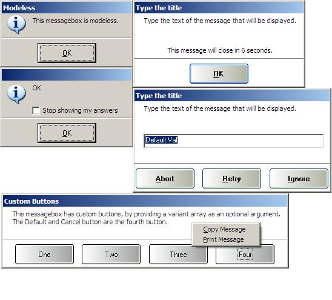



## Very functional messagebox

### Description

This code shows how you can make very functional and very pretty messageboxes and inputboxes, and it provides an implemented interface to allow all of the dialogs in your applications to be standardized for simple access. See the OPC directory for the two items used by this code that are 'Other people's code'. (Winsubhook and lvButtons.) You MUST register the Winsubhook type library before this group will run. This can be done with the references dialog of VB, using the browse button. Vote/Comments are unnecessary (Bug reports are very much appreciated), I just hope that someone finds this as useful as I have found much of the code on this site.
 
### More Info
 

             |
---                |---
**Submitted On**   |2004-01-12 17:16:22
**By**             |[selftaught](https://github.com/Planet-Source-Code/PSCIndex/blob/master/ByAuthor/selftaught.md)
**Level**          |Beginner
**User Rating**    |3.4 (17 globes from 5 users)
**Compatibility**  |VB 6\.0
**Category**       |[Coding Standards](https://github.com/Planet-Source-Code/PSCIndex/blob/master/ByCategory/coding-standards__1-43.md)
**World**          |[Visual Basic](https://github.com/Planet-Source-Code/PSCIndex/blob/master/ByWorld/visual-basic.md)
**Archive File**   |[Very\_funct1693571122004\.zip](https://github.com/Planet-Source-Code/selftaught-very-functional-messagebox__1-50960/archive/master.zip)

